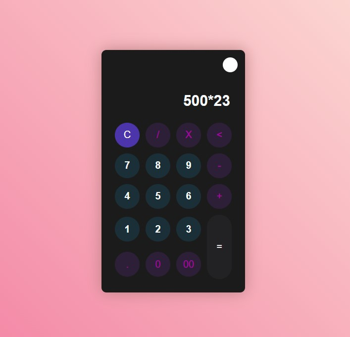
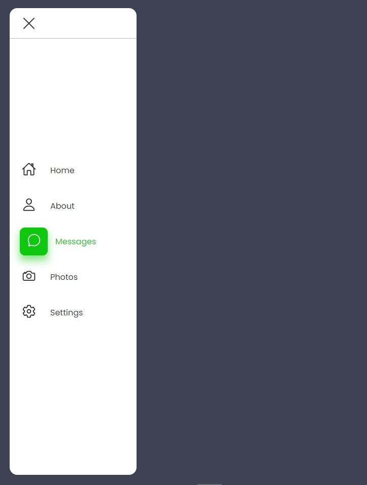
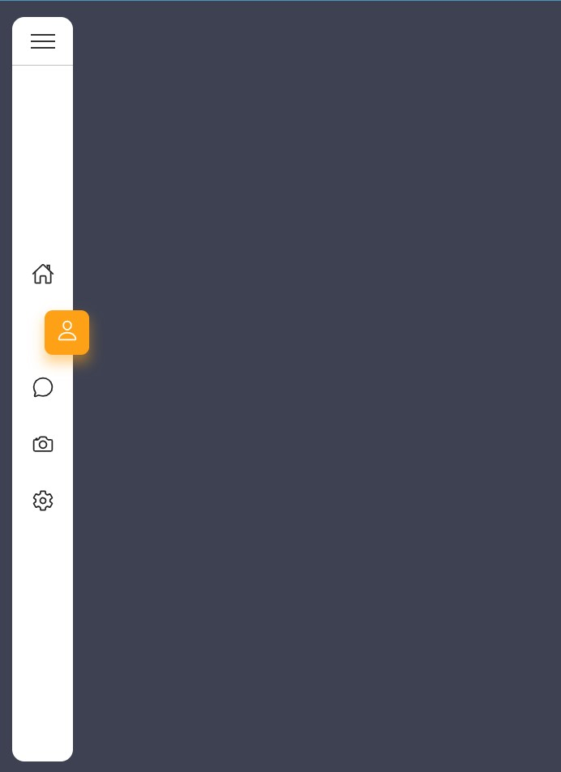
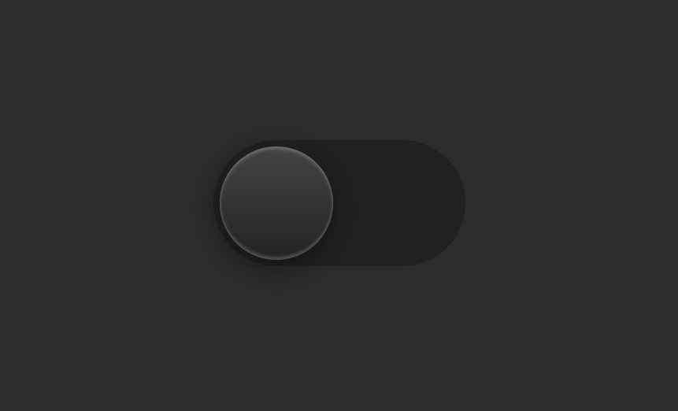
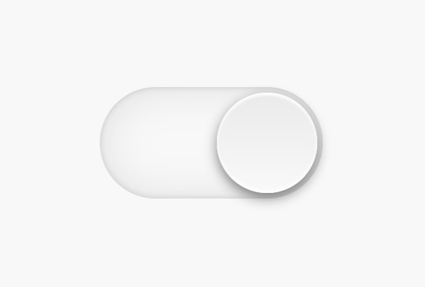

# Javascript Projects 

## Introduction
This repository will serve to save all of my projects, training and examples on source Javascript. Let's come see it.

## Technologies
- JavaScript
- HTML
- SCSS

## Preview 

Preview of Calculator

 

  
   

Preview of Elegant Menu

 

  
   

Preview of Theme Dark/Light

 

  
   

* Hope you like 😉